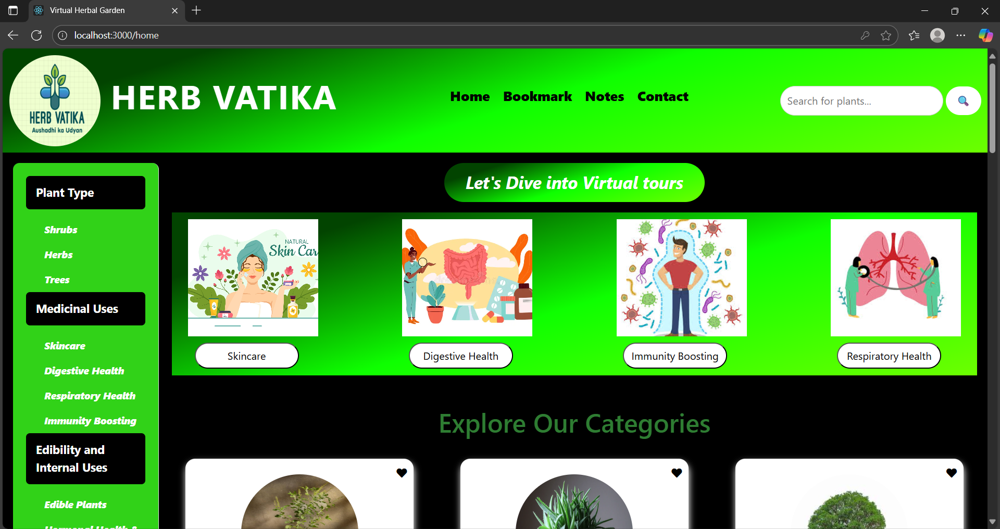
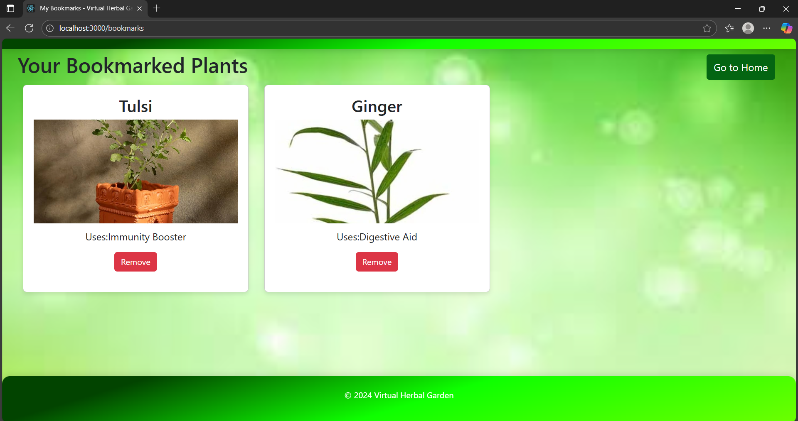

# Virtual Herbal Garden

Welcome to the **Virtual Herbal Garden**! This project is an interactive web application that allows users to explore, learn about, and interact with a wide variety of medicinal plants in a virtual 3D environment.

## 🌱 About the Project

The Virtual Herbal Garden is designed to educate users about the medicinal uses, cultivation methods, and habitats of various plants. Users can:

- Take virtual tours of themed gardens (e.g., Skincare, Digestive Health, Immunity Boosting, Respiratory Health)
- View detailed plant information, including 3D models
- Bookmark favorite plants and save personal notes
- Search for plants by category or medicinal use
- Watch educational videos and listen to plant details via speech synthesis

The project uses **Node.js**, **Express**, **MongoDB**, **Handlebars (hbs)** for server-side rendering, and **Three.js** for 3D visualization.

## 🚀 Features

- User authentication (signup/login)
- Interactive 3D virtual tours with clickable plant models
- Plant detail pages with images, 3D models, and medicinal info
- Bookmark and notes functionality for registered users
- Responsive design with custom CSS and Bootstrap
- Contact form for user feedback

## 📸 Screenshots

### Home Page

<br>
screenshots/home_02.png

### Virtual Tour Example


### Plant Details


### Bookmarks & Notes


## 🛠️ Installation

1. **Clone the repository:**
   ```sh
   git clone  https://github.com/Rishii123/Herbal_Garden.git
